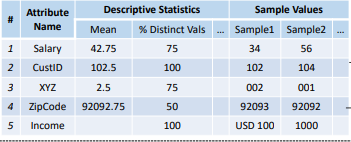

Base Featurization
==================
The first step, *Base Featurization* takes the raw csv and extracts specified base features
needed from the csv. These features include: column name, descriptive statistics (shown below), 
and 5 sample values. The descriptive statistics include 25 descriptive stats with a total list 
shown below. For the sample values 5 randomly sampled values are chosen from each 
column. These extracted features are then used to train ML models to infer feature 
types from columns in a new "unseen" csv file. 

.. figure:: images/descriptive_stats.png
   :scale: 100 %

   **All the descriptive stats used for *Base Featurization*. (Recreation of Table 6 from Shah et al.)**

   **Raw csv after *Base Featurization***