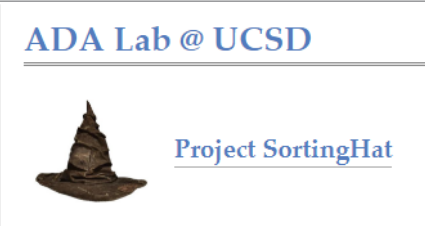

Project SortingHat
==================
The ADA lab at UCSD has been researching new ways to perform AutoML data preparation under 
Project SortingHat. Project SortingHat envisioned using an ML-based approach to 
automate ML data prepartion. Therefore, data preparation tasks are formalized into prediction
tasks. 

Project SortingHat has lead to the creation of the ML Data Prep Zoo. The ML Data Prep Zoo 
is a repository of benchmark labeled datasets and pre-trained ML models for data preparation 
tasks. The first data preparation task that was researched was feature type inference.

  