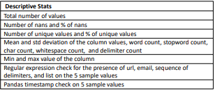

SortingHat Feature Type Inference Workflow
==========================================
.. figure:: images/full_workflow.png
   :scale: 100 %

   **Workflow showing how our data is used for ML-based feature type inference. (Recreation of Figure 4 from Shah et al.)**

The figure above shows the workflow for the SortingHat model of feature type inference. The 
first step (*Base Featurization*) is to take the raw csv and extract specified features. Next,
these extracted features are then used to train ML models to infer feature types from columns.
Finally, the trained ML model is used to infer feature types on an "unseen" csv.

*Base Featurization* takes on average the longest amount of time during 
AutoML feature type inference and the whole workflow is bottlenecked at this step. 
This is because *Base Featurization* is the only step in the workflow that iterates through 
the whole dataframe including every row and column. Therefore, Base Featurization has a 
time complexity of *O(N*M)*, while the actual inference (step 5) only has a 
time complexity of *O(M)* where *𝑁* and *𝑀* are respectively the number of rows and the
number of columns.  

Base Featurization
==================
*Base Featurization* takes the raw csv and extracts specified base features
needed from the dataset. These features include: column name, 5 randomly-chosen unique sample
values, and various descriptive statistics. The descriptive statistics include 25 statistics with a total list 
shown below. 

   **All the descriptive stats used for *Base Featurization*. (Recreation of Table 6 from Shah et al.)**

.. figure:: images/basefeaturization.png
   :scale: 100 %

   **Raw csv after *Base Featurization***
 

