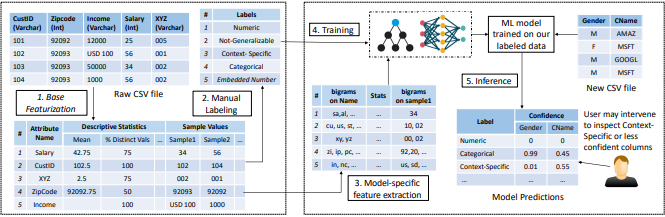

AutoML feature type inference Workflow
======================================
Base Featurization takes on average the longest amount of time during auto feature type inference and as a result the whole workflow is bottle necked at this step. 
This is because Base Featurization is the only step in the workflow that iterates through the whole dataframe including every row and column. 
Therefore, Base Featurization has a time complexity of O(Row*Column), while the actual inference (step 5) itself only has a time complexity of O(Column).  

   Workflow showing how our data is used for ML-based feature type inference. (Recreation of Figure 4 from Shah et al.)

