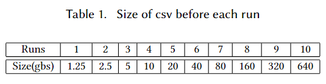
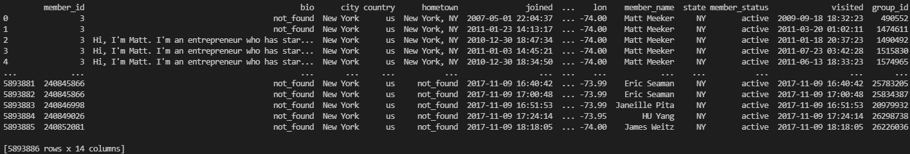

Build
=====
After confirming our implementation of PySpark for Base Featurization 
is indeed accurate, we then intend to study the preprocessing time for 
scalability. To do this we intend to time our implementation for a number of runs. 
To test for scalability we will use a range of sizes for the input csv 
starting around 1 GB then increasing till we reached at least >100 GB of data.

**dataset**

The csv we chose for our experiment was the members.csv. This data was 
collected from meetup.com API in December 2017 and includes a list of 
members from the site. The inital size of the csv is ~1.25 gbs and it 
has ~6 million rows and 14 columns. Therefore, for our experiment we 
doubled (*2x*) the rows of the input csv after each timed run until we reached 
our cluster's capacity (Table 1). Based on our current cluster configuration
the csv was scaled till it reached ~600 gbs.

   **Table 1**

   **members.csv**

To make sure we only timed the *Base Featurization* itself all csvs used in the experiment 
were saved to memory first as a parquet. Also, the same *SparkSession* was used throughout. 
