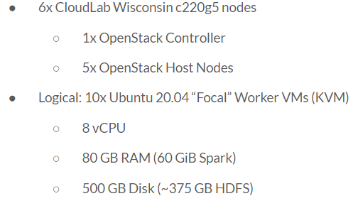

Cluster
=======
We ran these trials on a CloudLab Wisconsin-hosted OpenStack cluster. 
The configuration is listed below:

   **Figure 2**

For the cluter itself, we used Spark-Up to provision ten worker nodes for Spark and HDFS.
Each of these worker nodes has 8 virtual CPU cores, 80Gbs of memory, and 500 GBs of disk.
On each node, we dedicate all CPU cores and 60 GiB of memory to Spark, and approxiatemly 
375 GBs of disk space for HDFS.

We also provisioned a cluster manager node for the Spark master and HDFS Namenode with 4 
virtual CPU cores, 24 GBs of memory, and 160 Gbs of disk.

All machines at all layers of this cluter use Ubuntu 20.04 Focal, and thus version 5.4.0
of the Linux kernel. The experiment itself uses Python 3.10.2, Java 11 (Temurin 11.0.14.1+1),
Spark and Pyspark 3.2.1, and Hadoop 3.3.1. 

